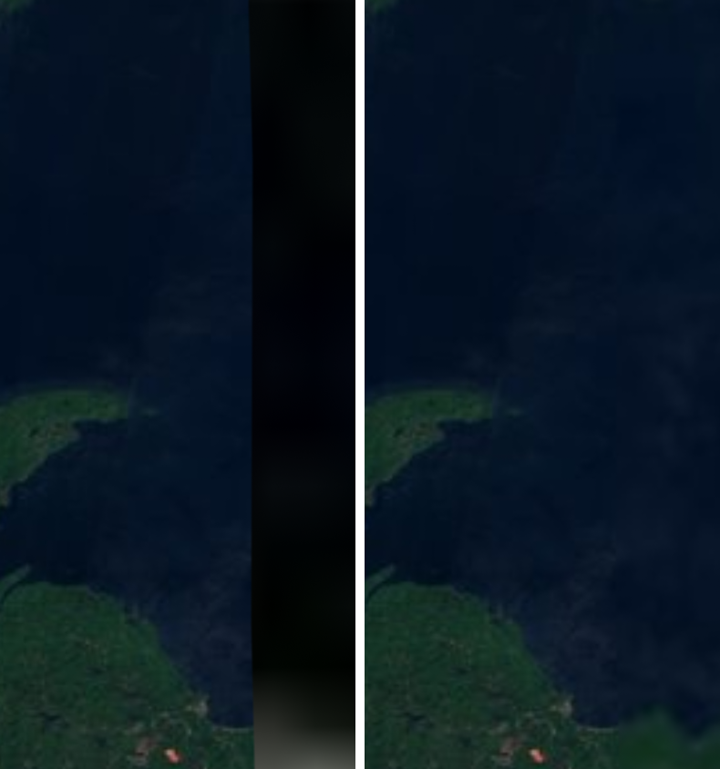
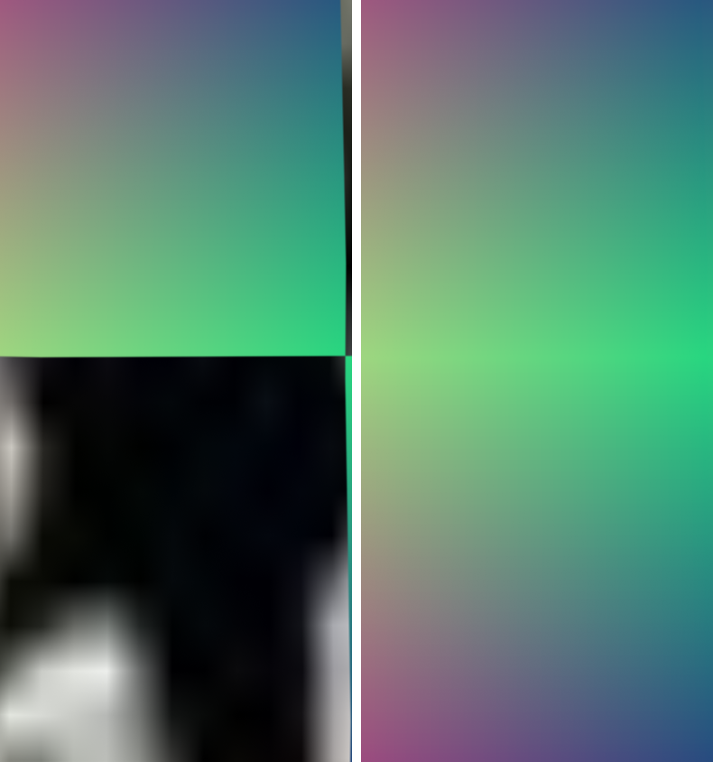
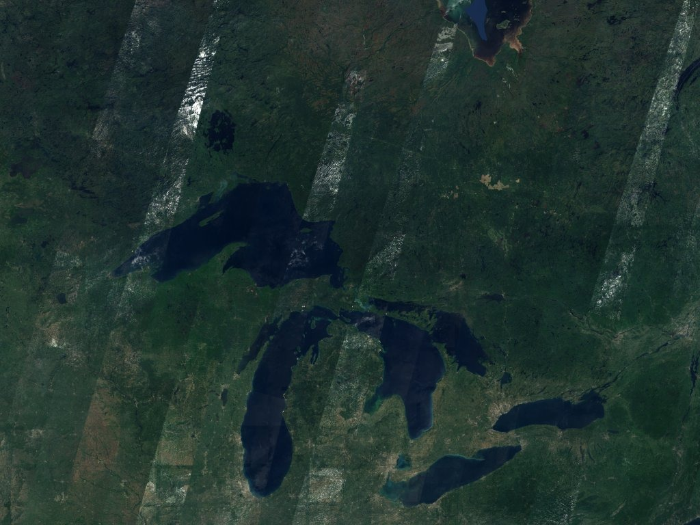
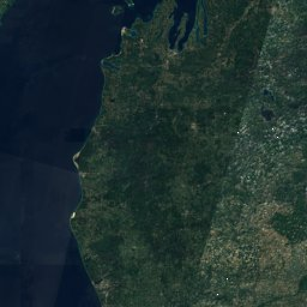

# Tile seams and white streaks in R2 satellite detail

Opus 5.5, 2026-10-10. All findings below were measured with headless Chromium
(Playwright, SwiftShader WebGL, 390x844 viewport) and pixel analysis in numpy.
The live site was fetched via curl and served through Playwright routing, and
R2 tiles were cached locally so the before and after runs see identical pixels.
Nothing here is estimated.

## TL;DR

| Symptom | Cause | Fixable in client? |
|---|---|---|
| Hard vertical/horizontal lines at tile edges | **Sparse R2 coverage.** R2 has every tile at z0-3 but only the 3x3 around each game location at z4-z11 (`scripts/prefetch-eox-tiles.mjs`). Missing tiles 404, the inset stays transparent there, and the NASA Blue Marble base shows through, with a hard step in sharpness and colour at the tile edge. | **Yes, fixed** (ancestor overzoom, below) |
| White diagonal streaks (Great Lakes) | **In the source imagery.** These are Sentinel-2 orbit-swath strips of haze/thin cloud baked into the EOX s2cloudless **2016** mosaic. They're present byte-for-byte in the R2 JPEGs. | No. Needs a different imagery source/vintage |
| Faint near-vertical tone bands, tone steps across lakes | **In the source imagery.** These are swath/granule boundaries in the same 2016 mosaic (e.g. a horizontal tone break inside Lake Michigan in tile 7/33/46). | No |
| Projection mismatch (Sean's hypothesis) | **Ruled out.** EPSG:3857 math is correct, and a synthetic test shows zero misregistration between tiles. | n/a |

## 1. Projection math: correct

`src/main.js` (globe fragment shader, `insetSample`, and `mercX`/`mercY`):

- Tiles are sampled per fragment: `merc = (u, 0.5 - ln(tan(pi/4 + lat/2)) / 2pi)`,
  with lat taken from the sphere's equirectangular `vUv.y`. That is exact Web
  Mercator. Latitude is clamped at ±85.0511°, the 3857 limit.
- `mercX(p) = atan2(p.z, -p.x)/2pi` matches three's `SphereGeometry` (`x = -cos(phi)sin(theta)`, `z = sin(phi)sin(theta)` → `atan2 = phi = u*2pi`).
- Tile placement in the 2048² render target is exact and texel-aligned (`sx*256, sy*256`), and the bounds are `INSET_TILES/n` wide.

**Measured proof.** Playwright serves synthetic tiles instead of R2:
- `gray`: every tile is flat 128 grey. The render is flat (std 0.26, which is the dither). No lines.
- `ramp`: triangle waves in global pixel x (R) and y (G). Any tile-edge offset or
  seam would show as a step. Second-difference peak/median per column/row is
  1.3-2.6 in all three views (Lake Michigan, Huron, Po valley). That's noise level, with no spikes at tile edges.

So the shader warp is not the source of the seams.

## 2. Root cause of the seams: holes in R2 coverage

The prefetch only uploaded z4-z11 tiles near the 1,928 locations. Example
(Lake Superior, z7): tiles 33/43, 33/44, 33/45, 34/43, 34/44 all 404. Before
the fix, the inset was cleared to alpha 0 there and the blurry NASA base showed through. Over
water that's near-black, so there was a hard vertical line at the tile edge.

Left is before (live site, pixel-identical to the local run: mean |diff| 0.0).
Right is after. The right-hand strip goes from mean luma 7.5 (black base) to 18.5 (EOX water,
continuous with the neighbour).

## 3. Fix (src/main.js, Detail insets)

**Ancestor overzoom**, the standard slippy-map approach. When a tile's source 404s, the tile
steps up to its parent (z-1, z-2, …), crops the quarter/sixteenth of the parent that covers
it, upscales the crop to 256 px on a canvas, and uploads it in the tile's slot. z0-3 are
complete in R2, so the chain always ends in EOX imagery and never reaches the NASA base.

- `setInsetSrc` / `loadInsetTile`: each tile has `k` (levels up) and `src`/`url`.
  Known-missing sources (`inset.missing`) are skipped without refetching, and tiles
  that share an ancestor share one fetch (`inflight` is keyed by source).
- `fetchInsetTile` delivers to *every* waiting tile with that source. A 404 now
  advances to the parent instead of finishing the tile empty.
- `cropInsetTile`: `drawImage` with a source rect. Per the HTML spec, the filter takes
  neighbouring pixels from outside the rect, so adjacent fallback tiles are continuous.
- New windows pre-advance tiles through the known-missing set, so sources already in flight aren't aborted.
- `window.__sat.inset.fallback` counts fallback tiles in the current window (debug).
- Backup of the pre-fix file: `src/main.js.bak-tile-seams`.

**Validation of the crop math** (`wramp-sparse`): a triangle-wave ramp anchored in *world*
units (so an upscaled ancestor must line up exactly with real children), with ~1/3 of
z4+ tiles forced to 404:

| View | before: row peak/median | after | fallback tiles |
|---|---|---|---|
| Huron | **71.7** | 1.5 | 6 |
| Po valley | **30.8** | 1.7 | 4 |
| Michigan (no hole on screen) | 1.9 | 1.9 | 3 |

Before: the holes show the base (black/grey) with hard edges. After: the ramp is seamless. The
bright horizontal band is the triangle wave's peak, not a seam. Real-tile renders after the fix:
no page errors, all windows complete and mipped (`ok: true`).

## 4. White streaks: source imagery, not rendering

Montage of the raw R2 z6 tiles over the Great Lakes (no renderer involved):

The white diagonal strips run NNE-SSW, which is the Sentinel-2 descending-orbit swath
direction. They're thin cloud and haze that the 2016 cloudless compositing didn't remove. The
same image shows tone-step swath boundaries crossing Lakes Michigan and Superior.
At z7 (tile 7/33/46, below) the lake has a horizontal tone break and a cloudy strip,
in the JPEG itself:

`compare-michigan.png` shows that step unchanged before and after the fix, as expected.

Options if these matter (Sean's call, not done):
1. Re-source from a newer EOX vintage (2018+ is much cleaner, but those layers are
   **non-commercial** licensed, per `docs/r2-pipeline-scope.md`).
2. Another imagery source (licence and cost trade-offs in `docs/satellite-sources-v2.md`).
3. Shader-side de-haze (local contrast/whiteness suppression). This is lossy and would also dull real
   snow, salt flats and sand, so I don't recommend it.

## Caveats

- After the fix, a fallback tile is sharp-to-soft at the edge where it meets a real
  tile (resolution step, same colours). That's how every slippy map behaves while
  tiles are missing. The only way to remove it is filling R2 coverage (a wider prefetch
  ring, which means more EOX fetches and R2 storage).
- Fallback chains add a few round trips in sparse areas: up to (z - 3) sequential
  404s, cached per session in `inset.missing`.
- Validated on SwiftShader WebGL in Chromium, not on an iPhone GPU. The code paths used
  (`createImageBitmap(canvas)`, 2D `drawImage` with a source rect, `imageSmoothingQuality`)
  are all supported in iOS Safari 15+.
- Not committed or deployed.

## Repro

`shots-seams/seam-test.mjs <live|local> <real|gray|ramp|wramp-sparse> <prefix>`
(`VIEWS='[[name,lat,lng,dist],…]'`, `MAINJS=<file>` to A/B a different main.js), then
`python3 shots-seams/analyze.py <png>…` for the per-column/row seam score.
